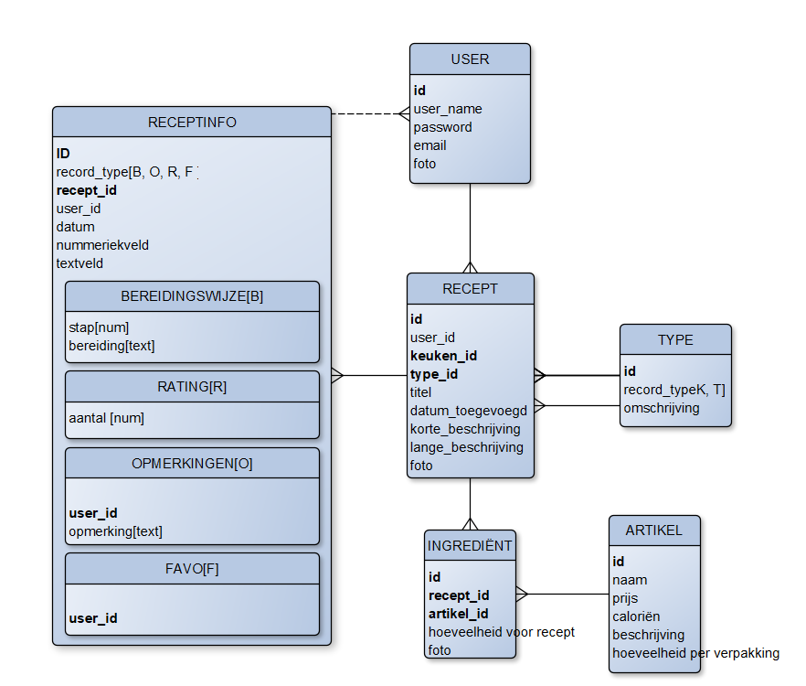
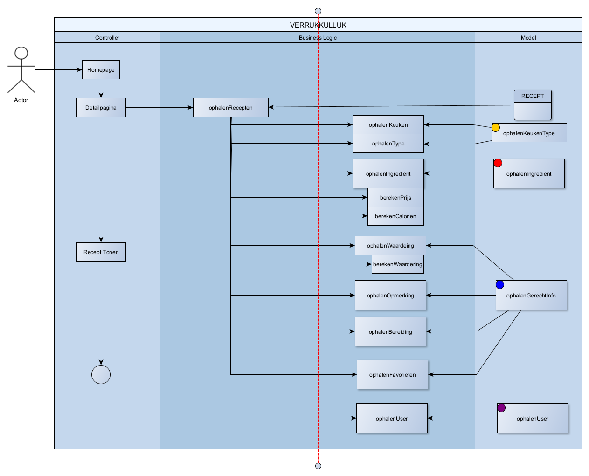

# Verrukkulluk, Recepten Site

 Verrukkulluk is een website waar je recepten kunt vinden met de benodigde ingrediënten, en waar je met deze ingrediënten een boodschappen lijst kunt samen stellen, er is een rating systeem dat de waardering per ingrediënt aangeeft en je kunt er opmerkingen lezen van andere mensen.

## Technologieën

de front-end van Verrukkulluk is gemaakt in de PHP template engine Twig middels HTML en CSS, de data wordt opgehaald uit een SQL database middels PHP en  de webstie heeft functionaliteiten die gebruik maken van javascript.

* PHP 
* JavaScript
* HTML
* CSS
* MySQL
* Restful API (POST/GET/PUT/DELETE)
* Design Patterns (MVC, Observer, Dependency Injection)
* Apache / IIS (etc)
* Applicatie Servers

Ik heb een ASD en ERD gebruikt om het programmeren van de back-end makkelijker te maken.

## Methoden & Technieken

### Entity Relationship Diagram
Dit diagram toont alle tabellen en de interacties hiertussen voor de database van Verrukkulluk

### Application Structure Diagram / Functionele Decompositie
Bijvoorbeeld: "Dit diagram toont het proces voor het aanmaken van een gebruiker."

## Meer informatie

Adobe XD Prototype: https://xd.adobe.com/view/d364d780-09f9-4671-80bc-0e0973e7e112-8637/
Design System op ZeroHeight: https://zeroheight.com/471a18241/p/992c96-educom
